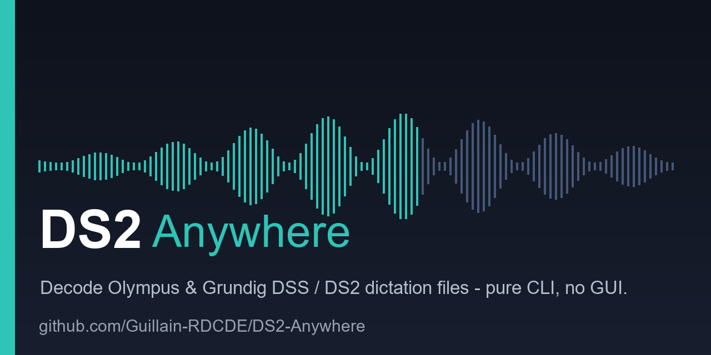

# DS2-Anywhere

> Open the dictation formats that stayed locked for thirty years — Olympus **DS2/DSS**
> and now **Grundig DSS** — on any Linux box. No Windows, no GUI, no commercial
> software. A production recipe *and* the reverse-engineering trail behind it. 🔓

     

**In one sentence:** doctors, lawyers and police dictate into small voice recorders;
the file format those recorders produce was kept secret for thirty years; this project
opens it on any Linux machine — and gives the fix back to the open-source tools everyone
uses.

> ### Have a file right now?
>
> **[→ Open the decoder](https://guillain-rdcde.github.io/DS2-Anywhere/)** and drag it in.
> Nothing to install, nothing uploaded — it runs inside your browser tab, and you can
> prove it by going offline first. Olympus DSS and DS2, Grundig DSS, encrypted files too.
>
> Prefer to read before clicking? **[Start here](docs/TRANSCRIBE-A-DSS.md)** — ten
> minutes, no background assumed.

---

A handful of strangers who never met opened a family of formats that doctors, lawyers
and police have dictated billions of seconds into.

Part of it was already ajar, and we are careful to say so: **Oleksij Rempel put a DSS-SP
decoder into FFmpeg in 2014**, and it worked. The rest was shut — DS2 entirely, and a
Grundig variant that *nothing on earth* could read, not FFmpeg, not us, not even the
commercial software. One person reverse-engineered the first piece; others made it
portable. We put it in production over a weekend, and cracked the Grundig codec in an
afternoon by interrogating the manufacturer's own decoder inside a debugger built from
its DLLs.

Then we found that the part everyone assumed was solved had been quietly corrupting a
whole class of recordings for years — in every open implementation, ours included. We
diagnosed it wrong first, in public, and had to withdraw the patch. **[That chapter is
the best one here.](docs/17-the-framing-was-wrong.md)**

All of it is in this repo: the working code, and exactly how it was done — including the
parts where we were wrong.

## More

**[Reference](docs/REFERENCE.md)** — what it does, the technical trail, where it stands, real-world numbers, what is in this repo, and credits.

## License

MIT, same as the upstream codec. Fork, adapt, deploy — please keep attribution to the codec authors. We publish the clean reimplementations and the recovered specs, never the vendors' proprietary code.

---

*Thirty years of locked, one bash command later. The chain has to keep going. 🔓*
